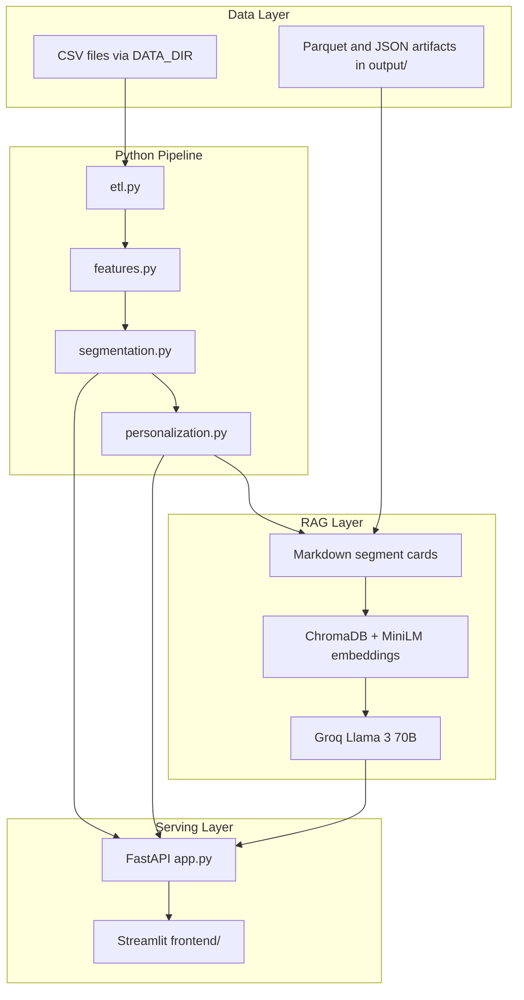

# Shopper Segmentation & Personalization Engine

## Overview

An end-to-end data science platform for retail shopper analytics, built on the **dunnhumby Complete Journey** dataset. The system transforms raw transaction and campaign data into actionable shopper segments, product recommendations, and campaign uplift insights—delivered through a FastAPI backend, Streamlit dashboard, and RAG-powered analyst chatbot.

Retail analysts and data scientists can explore segments visually, query insights in natural language, and ground campaign decisions in statistically validated metrics.

## Table of Contents

- [Problem Statement](#problem-statement)
- [Features](#features)
- [Tech Stack](#tech-stack)
- [Architecture](#architecture)
- [Project Structure](#project-structure)
- [Installation](#installation)
- [Configuration](#configuration)
- [Usage](#usage)
- [Training Pipeline](#training-pipeline)
- [Inference](#inference)
- [API / UI](#api--ui)
- [Dataset](#dataset)
- [Model](#model)
- [Evaluation Metrics](#evaluation-metrics)
- [Results](#results)
- [Future Improvements](#future-improvements)
- [Folder Structure](#folder-structure)
- [Requirements](#requirements)
- [License](#license)

## Problem Statement

Retail organizations collect vast amounts of transaction, demographic, and campaign data, but struggle to translate it into targeted marketing actions. Key challenges include:

- **Fragmented data** across transactions, products, demographics, and campaigns
- **High-dimensional shopper behavior** that is difficult to interpret without segmentation
- **Limited analyst accessibility** — insights are locked in notebooks and SQL, not self-serve tools
- **Weak campaign targeting** without segment-level uplift and product affinity signals

This project addresses these gaps with a reproducible pipeline from ETL through clustering, personalization, and conversational analytics.

## Features

- **DuckDB ETL** — Join and aggregate 8 source CSVs into household-level features
- **Feature engineering** — RFM, spend/trip metrics, promo sensitivity, category mix, and demographics
- **KMeans segmentation** — Automatic k selection (4–8) with silhouette, GMM, and bootstrap validation
- **Product recommendations** — Lift-based ranking of top products per segment
- **Campaign uplift analysis** — Diff-in-means incremental spend with 95% confidence intervals
- **RAG analyst chatbot** — Retrieve segment context via ChromaDB; answer with Groq Llama 3 70B
- **Production serving** — FastAPI REST API and Streamlit dashboard with Plotly visualizations
- **Numeric guardrails** — Post-hoc validation of LLM-cited metrics against retrieved context

## Tech Stack

| Layer | Technology |
|-------|------------|
| ETL & joins | DuckDB, PyArrow |
| Features & ML | pandas, scikit-learn |
| Vector store | ChromaDB |
| Embeddings | sentence-transformers (`all-MiniLM-L6-v2`) |
| LLM | Llama 3 70B via Groq API |
| API | FastAPI, uvicorn |
| Frontend | Streamlit, Plotly |
| Testing | pytest |

## Architecture

The platform spans four layers: data ingestion, batch analytics pipeline, RAG retrieval, and application serving.



**Data Layer** — External CSV inputs and versioned artifacts in `output/`.

**Pipeline** — Sequential batch modules produce household features, segment assignments, and personalization reports.

**RAG Layer** — Segment cards are embedded and indexed; queries retrieve top-k context for LLM generation.

**Serving Layer** — FastAPI exposes artifacts; Streamlit provides interactive exploration and chat.

## Project Structure

| Module | Path | Responsibility |
|--------|------|----------------|
| 1. ETL | `src/shopper_segmentation/etl.py` | DuckDB load, join, household aggregation |
| 2. Features | `src/shopper_segmentation/features.py` | RFM, promo, category, demographic features |
| 3. Segmentation | `src/shopper_segmentation/segmentation.py` | KMeans clustering, profiling, PCA |
| 4. Personalization | `src/shopper_segmentation/personalization.py` | Product lift and campaign uplift |
| 5. RAG | `src/shopper_segmentation/rag/` | Card building, embedding, retrieval, chat chain |
| 6. API | `src/shopper_segmentation/api/app.py` | REST endpoints for segments and chat |
| 7. UI | `frontend/` | Streamlit dashboard and analyst chat |

## Installation

**Prerequisites:** Python 3.11+, dunnhumby Complete Journey dataset (8 CSVs), Groq API key.

```powershell
cd "Shopper Segmentation RAG"
python -m venv .venv
.\.venv\Scripts\activate
pip install -e .
pip install -r requirements.txt
```

On Linux/macOS, activate with `source .venv/bin/activate`.

## Configuration

Create a `.env` file in the project root (copy from `.env.example`):

```env
DATA_DIR=../shopper-data
GROQ_API_KEY=gsk_your_key_here
API_KEY=change-me
ALLOWED_ORIGINS=http://localhost:8504
```

| Variable | Required | Description |
|----------|----------|-------------|
| `DATA_DIR` | Yes | Path to directory containing 8 dunnhumby CSV files |
| `GROQ_API_KEY` | For chat | Groq API key ([console.groq.com](https://console.groq.com/)) |
| `API_KEY` | Yes | API key for protected endpoints (`X-API-Key` header) |
| `ALLOWED_ORIGINS` | No | Comma-separated CORS origins (default: `http://localhost:8504`) |
| `API_BASE_URL` | No | Frontend API override (default: `http://127.0.0.1:8000`) |
| `CHAT_CACHE_TTL_SECONDS` | No | TTL for in-memory `/chat` response cache (default: `3600`) |
| `MIN_SEGMENT_CONFIDENT_N` | No | Minimum households for confident segment profiling (default: `30`) |

The application fails with a clear error if `GROQ_API_KEY` is missing for chat endpoints. Protected routes require a valid `X-API-Key` header; `/health` remains open. Keys are never logged or hardcoded.

**Data directory layout** (default: sibling folder `../shopper-data/`):

```
../shopper-data/
├── transaction_data.csv
├── product.csv
├── hh_demographic.csv
├── campaign_table.csv
├── campaign_desc.csv
├── coupon.csv
├── coupon_redempt.csv
└── causal_data.csv
```

Absolute paths are supported, e.g. `DATA_DIR=C:\data\shopper-data` on Windows.

## Usage

### 1. Run the training pipeline

See [Training Pipeline](#training-pipeline) below.

### 2. Start the API server

```powershell
uvicorn shopper_segmentation.api.app:app --host 127.0.0.1 --port 8000 --reload
```

### 3. Launch the dashboard

```powershell
streamlit run frontend/app.py --server.port 8504
```

| Service | URL |
|---------|-----|
| Dashboard | [http://localhost:8504](http://localhost:8504) |
| OpenAPI docs | [http://127.0.0.1:8000/docs](http://127.0.0.1:8000/docs) |

### 4. Run tests

```powershell
pytest tests/ -v
```

## Training Pipeline

The pipeline is a batch artifact-generation workflow (not deep-learning training). Run modules sequentially:

```powershell
python -m shopper_segmentation.etl
python -m shopper_segmentation.features
python -m shopper_segmentation.segmentation
python -m shopper_segmentation.personalization
python -m shopper_segmentation.rag.rag_chain
```

Or use the bundled script (modules 1–4; RAG index builds on first retrieval or via `rag_chain`):

```bash
bash scripts/run_pipeline.sh
```

**Artifacts produced in `output/`:**

| File | Description |
|------|-------------|
| `household_features_raw.parquet` | Post-ETL household aggregates |
| `household_features.parquet` | Engineered feature matrix |
| `household_segments.parquet` | Segment assignments + PCA coordinates |
| `segment_profiles.json` | Segment metadata, metrics, narratives |
| `segment_profiles.md` | Human-readable profile summary |
| `segment_recommendations.json` | Top product lifts per segment |
| `uplift_report.json` | Campaign uplift by segment |
| `chroma/` | Persistent ChromaDB vector index |

## Inference

Inference is artifact-based serving plus on-demand RAG generation.

**Segment & recommendation serving** — FastAPI loads precomputed JSON artifacts at startup and serves them via REST endpoints. No model re-fit at request time.

**RAG chat inference flow:**

```
User query
  → embed query (all-MiniLM-L6-v2)
  → ChromaDB top-k=3 retrieval
  → inject segment cards into prompt
  → Groq Llama 3 70B (temperature=0.1)
  → validate cited numbers against context
  → JSON response
```

The Chroma index is built lazily on first retrieval or explicitly via `rag_chain`.

## API / UI

### REST API

| Method | Path | Auth | Description |
|--------|------|------|-------------|
| `GET` | `/health` | No | Health check |
| `GET` | `/segments` | Yes | List all segments |
| `GET` | `/segments/{id}` | Yes | Segment detail and feature means |
| `GET` | `/segments/{id}/recommendations` | Yes | Top product recommendations by lift |
| `POST` | `/chat` | Yes | RAG analyst chatbot (`{"query": "..."}`), rate-limited to 10/min |

Protected routes require the `X-API-Key` header. `/chat` returns 503 if `GROQ_API_KEY` is missing, 429 if rate-limited, and 502 on LLM failure.

### Streamlit Dashboard

| Page | Description |
|------|-------------|
| **Segment Overview** | PCA scatter, segment size bar chart, radar profile vs. population |
| **Recommendations** | Top-N product table by lift per segment |
| **Analyst Chat** | Natural language Q&A with example prompts and validation flags |

## Dataset

**Source:** [dunnhumby Complete Journey](https://www.dunnhumby.com/sourcefiles) — anonymized grocery transaction, demographic, and campaign data.

| Property | Value |
|----------|-------|
| Input files | 8 CSVs (transactions, products, demographics, campaigns, coupons, causal) |
| Households analyzed | 2,500 |
| Storage | External to repo via `DATA_DIR` (gitignored) |
| License | Subject to dunnhumby dataset terms; not redistributed in this repository |

## Model

### Segmentation (KMeans)

| Component | Detail |
|-----------|--------|
| Preprocessing | `StandardScaler` on engineered features |
| Algorithm | `KMeans` (k ∈ 4–8, `n_init=10`, `random_state=42`) |
| k selection | Maximum silhouette score; elbow/inertia as tie-breaker |
| Validation | `GaussianMixture` cross-check (ARI); bootstrap stability (10 runs, 80% sample) |
| Visualization | 2-component PCA for dashboard scatter plots |
| Labeling | Rule-based names from z-score thresholds (e.g. Campaign-Responsive, Premium Loyal) |

**Selected configuration:** k = 8 clusters.

### Personalization (Statistical)

- **Product lift:** `segment_purchase_rate / population_purchase_rate`
- **Campaign uplift:** Diff-in-means (exposed vs. same-segment control) with 95% CI (`z = 1.96`)

### RAG Stack

| Component | Detail |
|-----------|--------|
| Context | Markdown segment cards from pipeline JSON |
| Embeddings | `all-MiniLM-L6-v2` (sentence-transformers) |
| Vector store | ChromaDB collection `segment_cards` |
| LLM | Groq `llama3-70b-8192` |
| Guardrails | Post-hoc numeric validation against retrieved cards |
| Agent | LangGraph router → retrieve → generate → guardrail flow |
| Observability | Optional LangSmith tracing via `LANGCHAIN_*` environment variables |

### LangSmith tracing

Enable LangSmith traces for the LangGraph analyst agent by setting these variables (see [.env.example](.env.example)):

```env
LANGCHAIN_TRACING_V2=true
LANGCHAIN_API_KEY=your-langsmith-api-key
LANGCHAIN_PROJECT=shopper-segmentation
```

Traces include router decisions, retrieval, LLM generation, and guardrail validation. `load_dotenv()` runs at API startup before the graph is imported so tracing is active for `/chat` requests.

## Evaluation Metrics

### Clustering quality

| Metric | Value |
|--------|-------|
| Selected k | 8 |
| Silhouette score (k=8) | 0.338 |
| GMM ARI vs. KMeans | 0.751 |
| Mean bootstrap ARI | 0.557 |

Silhouette was evaluated across k = 4–8; k = 7 dropped sharply to 0.045, supporting k = 8.

### Personalization & uplift

| Metric | Method |
|--------|--------|
| Product affinity | Lift ratio with minimum support filters |
| Campaign response | Incremental spend % with 95% confidence intervals |
| Segment stability | Bootstrap ARI across 10 resampled fits |

## Results

### Segment summary (2,500 households, 8 clusters)

| ID | Segment | Size | % of Base |
|----|---------|------|-----------|
| 0 | Balanced Mainstream Shoppers | 1,692 | 67.7% |
| 1 | Balanced Mainstream Shoppers | 252 | 10.1% |
| 2 | Campaign-Responsive Shoppers | 67 | 2.7% |
| 3 | Balanced Mainstream Shoppers | 120 | 4.8% |
| 4 | Balanced Mainstream Shoppers | 303 | 12.1% |
| 5 | Premium Loyal Shoppers | 5 | 0.2% |
| 6 | Campaign-Responsive Shoppers | 50 | 2.0% |
| 7 | Premium Loyal Shoppers | 11 | 0.4% |

**Notable traits:** Segment 2 averages **$6,688** spend with **0.38** promo responsiveness; Segment 7 averages **$8,548** spend.

### Campaign uplift highlights

| Segment | Incremental Spend | 95% CI |
|---------|-------------------|--------|
| 0 — Balanced Mainstream | +124.6% | [116.8%, 132.5%] |
| 2 — Campaign-Responsive | +44.3% | [32.7%, 55.9%] |
| 6 — Campaign-Responsive | +42.4% | [30.6%, 54.2%] |

Segment 0 shows the largest absolute uplift; Segments 2 and 6 offer tighter confidence intervals for precision promo targeting.

### Top product lift (Segment 2)

| Product ID | Lift | Segment Purchase Rate |
|------------|------|-----------------------|
| 12171407 | 10.66× | 0.149 |
| 819487 | 9.33× | 0.149 |
| 5564948 | 7.46× | 0.149 |

### Analyst chatbot example

**Q:** Who are our high-value promo-sensitive shoppers?

**A:** Campaign-Responsive Shoppers (Segment 2) are the clearest promo-sensitive high-value group: 67 households (2.7% of base) with total spend 6,688.23, promo responsiveness 0.38, and +44.3% incremental spend during campaigns. Segment 6 (50 households) shows similar traits with +42.4% campaign uplift.

## Future Improvements

- **Clustering** — Experiment with HDBSCAN or production GMM; add model registry and versioning
- **MLOps** — CI/CD pipeline, `.env.example`, Docker Compose for one-command deployment
- **Serving** — Response caching, API authentication, real-time household scoring endpoint
- **RAG** — Hybrid retrieval (BM25 + dense), evaluation harness with groundedness metrics
- **Data** — Incremental ETL for new transaction windows; A/B test framework for campaigns
- **UX** — Segment comparison view, exportable campaign briefs, role-based dashboard access

## Folder Structure

```
shopper-segmentation/
├── src/
│   └── shopper_segmentation/
│       ├── etl.py                      # Module 1: DuckDB load & join
│       ├── features.py                 # Module 2: Feature engineering
│       ├── segmentation.py             # Module 3: KMeans clustering
│       ├── personalization.py          # Module 4: Recommendations & uplift
│       ├── rag/
│       │   ├── build_cards.py          # Segment card generation
│       │   ├── vectorstore.py          # LangChain Chroma retrieval
│       │   ├── tools.py                # Structured lookup tools
│       │   ├── agent/                  # LangGraph analyst agent
│       │   ├── evals/                  # RAG evaluation harness
│       │   └── rag_chain.py            # Chat adapter + guardrails
│       └── api/
│           └── app.py                  # Module 6: FastAPI backend
├── frontend/
│   ├── app.py                          # Streamlit entry point
│   ├── api_client.py                   # REST client
│   ├── charts.py                       # Plotly visualizations
│   └── pages/
│       ├── 1_Segment_Overview.py
│       ├── 2_Recommendations.py
│       └── 3_Analyst_Chat.py
├── tests/
│   ├── test_app.py
│   ├── test_features.py
│   ├── test_personalization.py
│   └── test_rag.py
├── scripts/
│   └── run_pipeline.sh                 # Pipeline runner (modules 1–4)
├── output/                             # Generated artifacts (gitignored)
│   ├── household_features_raw.parquet
│   ├── household_features.parquet
│   ├── household_segments.parquet
│   ├── segment_profiles.json
│   ├── segment_profiles.md
│   ├── segment_recommendations.json
│   ├── uplift_report.json
│   └── chroma/
├── data/                               # Optional local CSV staging (gitignored)
├── pyproject.toml
├── requirements.txt
├── requirements.lock
├── .env.example
├── LICENSE
└── README.md
```

## Requirements

- **Python** ≥ 3.11
- **Core dependencies:** `duckdb`, `pyarrow`, `pandas`, `scikit-learn`, `chromadb`, `sentence-transformers`, `groq`, `fastapi`, `uvicorn`, `streamlit`, `plotly`, `httpx`, `python-dotenv`
- **Dev dependencies:** `pytest`, `ruff` (via `pip install -e ".[dev]"`)

See [requirements.txt](requirements.txt), [requirements.lock](requirements.lock), and [pyproject.toml](pyproject.toml) for dependency versions.

## Development

### Reproducible installs

Production and CI installs use the pinned lockfile:

```powershell
pip install -r requirements.lock
pip install -e ".[dev]"
```

Regenerate the lockfile after changing dependencies in `pyproject.toml`:

```powershell
pip install pip-tools
pip-compile pyproject.toml -o requirements.lock
```

### Linting and tests

```powershell
ruff check src tests frontend
pytest tests/ -v
```

CI also runs `pip-audit -r requirements.lock --ignore-vuln PYSEC-2026-311` to fail on high/critical CVEs. The ignore is temporary until chromadb releases a fix for CVE-2026-45829; this project uses local `PersistentClient` only and does not expose the ChromaDB FastAPI server.


