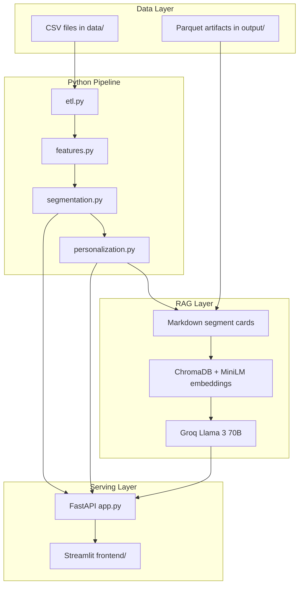

# Shopper Segmentation & Personalization Engine

End-to-end pipeline for the **dunnhumby Complete Journey** dataset: ETL, feature engineering, clustering, product recommendations, campaign uplift analysis, and a RAG-powered analyst chatbot.

## Architecture



## Project Structure

```
shopper-segmentation/
├── src/
│   └── shopper_segmentation/
│       ├── etl.py                   # Module 1: DuckDB load & join
│       ├── features.py              # Module 2: Feature engineering
│       ├── segmentation.py          # Module 3: KMeans clustering
│       ├── personalization.py       # Module 4: Recommendations & uplift
│       ├── rag/                     # Module 5: RAG chatbot
│       └── api/
│           └── app.py               # Module 6: FastAPI backend
├── frontend/                        # Module 7: Streamlit dashboard
├── tests/                           # pytest unit tests
├── scripts/
│   └── run_pipeline.sh              # Pipeline runner
├── data/                            # CSV files (gitignored)
├── output/                          # Artifacts (gitignored)
├── pyproject.toml
└── requirements.txt
```

## Setup

### 1. Clone and create virtual environment

```powershell
cd "Shopper Segmentation RAG"
python -m venv .venv
.\.venv\Scripts\activate
pip install -e .
```

### 2. Add data files

Place all 8 CSV files in `./data/`:

- `transaction_data.csv`, `product.csv`, `hh_demographic.csv`
- `campaign_table.csv`, `campaign_desc.csv`, `coupon.csv`, `coupon_redempt.csv`
- `causal_data.csv`

### 3. Configure Groq API key

1. Sign up at [https://console.groq.com/](https://console.groq.com/)
2. Create an API key
3. Copy `.env.example` to `.env` and set your key:

```env
GROQ_API_KEY=gsk_your_key_here
```

The app fails with a clear error if `GROQ_API_KEY` is missing — the key is never logged or hardcoded.

### 4. Run the pipeline

```powershell
python -m shopper_segmentation.etl
python -m shopper_segmentation.features
python -m shopper_segmentation.segmentation
python -m shopper_segmentation.personalization
python -m shopper_segmentation.rag.rag_chain   # builds Chroma index + demo queries
```

Or use the pipeline script:

```bash
bash scripts/run_pipeline.sh
```

### 5. Start backend and dashboard

Terminal 1 — API:

```powershell
uvicorn shopper_segmentation.api.app:app --host 127.0.0.1 --port 8000 --reload
```

Terminal 2 — Streamlit:

```powershell
streamlit run frontend/app.py
```

Open **http://localhost:8501** for the dashboard and **http://127.0.0.1:8000/docs** for OpenAPI docs.

## API Endpoints

| Method | Path | Description |
|--------|------|-------------|
| GET | `/segments` | List all segments |
| GET | `/segments/{id}` | Segment detail + feature means |
| GET | `/segments/{id}/recommendations` | Top product recommendations |
| POST | `/chat` | RAG analyst chatbot |

## Example Chatbot Q&A

These examples use segment cards retrieved by the RAG pipeline. With `GROQ_API_KEY` set, run `python -m shopper_segmentation.rag.rag_chain` or use the **Analyst Chat** page for live LLM responses.

### Q1: Who are our high-value promo-sensitive shoppers?

**Retrieved segments:** Campaign-Responsive Shoppers (segments 2 & 6), high-spend Balanced Mainstream (segment 1)

**Answer (from segment context):**

> **Campaign-Responsive Shoppers (Segment 2)** are the clearest promo-sensitive high-value group: **67 households** (2.7% of base) with **total_spend 6688.23**, **promo_responsiveness 0.38**, and **+44.3% incremental spend** during campaigns [32.7%, 55.9%]. **Segment 6** (50 households) shows similar traits with **+42.4%** campaign uplift. **Segment 1** (252 households) combines high spend (**4932.94**) with elevated promo responsiveness (**0.38**).

### Q2: What products should we target to segment 2 this week?

**Retrieved segments:** Campaign-Responsive Shoppers (segment 2)

**Answer (from segment context):**

> Target these high-lift GROCERY items for **Segment 2 — Campaign-Responsive Shoppers**:
> 1. Product **12171407** — lift **10.66×**, segment purchase rate **0.149**
> 2. Product **819487** — lift **9.33×**, segment purchase rate **0.149**
> 3. Product **5564948** — lift **7.46×**, segment purchase rate **0.149**

### Q3: Which segment shows the strongest campaign uplift?

**Retrieved segments:** Balanced Mainstream (segment 0), Campaign-Responsive (segments 2 & 6)

**Answer (from segment context):**

> **Segment 0 (Balanced Mainstream Shoppers)** shows the largest absolute uplift at **+124.6%** incremental spend [116.8%, 132.5%] across **2932 treated** vs **47828 control** household-campaign observations. Among named high-value promo segments, **Segment 2** shows **+44.3%** and **Segment 6** shows **+42.4%** with tighter confidence intervals — better targets for precision promo ROI.

## Tests

```powershell
pytest tests/ -v
```

## Dashboard Pages

1. **Segment Overview** — PCA scatter plot, segment size bar chart, radar profile vs population
2. **Recommendations** — Top-N product table by lift per segment
3. **Analyst Chat** — Natural language Q&A via `/chat`

## Tech Stack

| Component | Technology |
|-----------|------------|
| ETL & joins | DuckDB |
| Features & ML | pandas, scikit-learn |
| Vector store | ChromaDB |
| Embeddings | sentence-transformers (all-MiniLM-L6-v2) |
| LLM | Llama 3 70B via Groq API |
| API | FastAPI + uvicorn |
| Frontend | Streamlit + Plotly |
